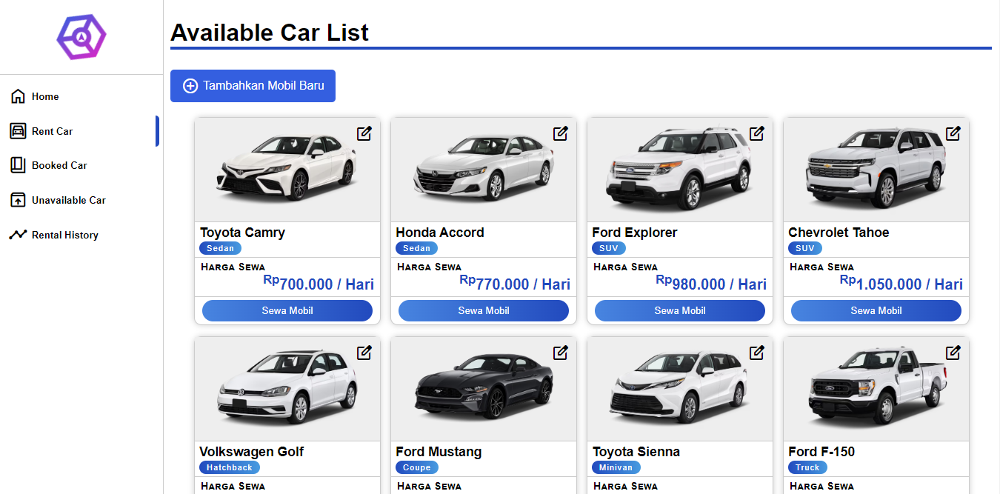

Live Demo: [https://luckwut.github.io/Rent-Car-Manager/](https://luckwut.github.io/Rent-Car-Manager/)

___
# Rent-Car-Manager

Rent-Car-Manager adalah website sederhana untuk simulasi penyewaan mobil. Web ini memanfaatkan [API LocalStorage](https://developer.mozilla.org/en-US/docs/Web/API/Window/localStorage) sehingga data akan tetap ada meskipun user keluar dari web (LocalStorage menyimpan data secara lokal di browser pengguna).

## Features

- CRUD (Create/Add, Read, Update/Edit, Delete) data mobil
- Sewa Mobil dan kalkulasi harga sewa per harinya
- Set status available/unavailable
- Lihat mobil yang tersedia di LocalStorage
- Lacak perubahan data mobil di tab riwayat
- Mobile Responsive

## Teknologi yang dipakai

- HTML
- CSS
- JavaScript

## Credits

Proyek ini menggunakan kode dari [TomasHubelbauer/github-pages-local-storage](https://github.com/TomasHubelbauer/github-pages-local-storage).

## Usage

Clone repository ini menggunakan command `git clone https://github.com/Luckwut/Rent-Car-Manager.git` atau download secara manual [Zip Berikut](https://github.com/Luckwut/Rent-Car-Manager/archive/refs/heads/main.zip).